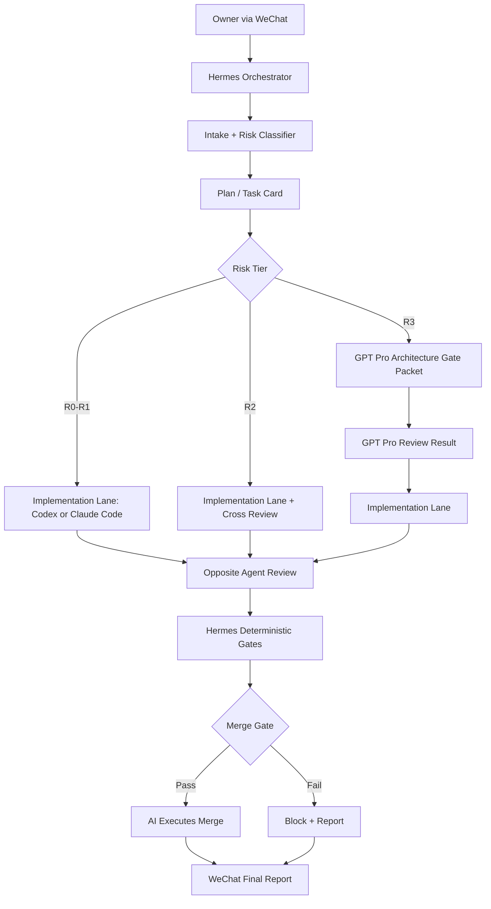

# homeAI Hermes Operating Architecture V1

## 1. Purpose

This document is the primary operating guide for Hermes when orchestrating homeAI through WeChat, Codex, Claude Code, and GPT Pro.

Hermes does not replace architecture judgment. Hermes owns workflow routing, deterministic checks, review packet assembly, merge-gate enforcement, and status reporting.

## 2. System architecture diagram



## 3. Module boundary table

| Module | Owner | May write code | May review | May merge |
|---|---|---:|---:|---:|
| WeChat Gateway | Hermes | No product code by default | N/A | No |
| Intake / routing | Hermes | Workflow files only | Yes | No |
| Task card generation | Hermes / GPT Pro | Docs only | Yes | No |
| Low-risk implementation | Codex or Claude Code | Yes | Opposite agent | No |
| Cross review | Opposite agent | No by default | Yes | No |
| GPT architecture gate | GPT Pro | No repo mutation | Yes | No |
| Deterministic gates | Hermes | No | Yes | No |
| Merge execution | Hermes or delegated agent | Only merge command | N/A | Yes, if gate passes |
| Space Truth red-zone | GPT-gated task only | Yes, if explicit | Cross + GPT | Only after R3 gates pass |

## 4. Workflow data model definitions

```ts
export type RiskTier = 'R0' | 'R1' | 'R2' | 'R3';

export interface HomeAITaskCard {
  taskId: string;
  title: string;
  riskTier: RiskTier;
  goal: string;
  nonGoals: string[];
  allowedFiles: string[];
  forbiddenFiles: string[];
  implementationAgent: 'codex' | 'claude-code';
  reviewAgent: 'codex' | 'claude-code';
  gptGateRequired: boolean;
  requiredCommands: string[];
  acceptanceCriteria: string[];
  mergePolicy: 'no-merge' | 'auto-merge-if-green' | 'gpt-gated-auto-merge-if-green';
}

export interface AgentReviewReport {
  reviewer: 'codex' | 'claude-code' | 'gpt-pro' | 'hermes';
  verdict: 'approve' | 'request_changes' | 'reject';
  blockingIssues: string[];
  nonBlockingIssues: string[];
  schemaApiImpact: string;
  spaceTruthImpact: string;
  renderPipelineImpact: string;
  softDecorGpsImpact: string;
  testGaps: string[];
  finalRisk: 'low' | 'medium' | 'high';
}

export interface MergeGateReport {
  prUrl: string;
  branch: string;
  base: 'main';
  riskTier: RiskTier;
  deterministicChecksPassed: boolean;
  crossReviewPassed: boolean;
  gptGatePassed?: boolean;
  noBlockingIssues: boolean;
  noUnauthorizedRedZoneDiff: boolean;
  noSecrets: boolean;
  noUnauthorizedNetworkCalls: boolean;
  noUnauthorizedRealProvider: boolean;
  mergeDecision: 'merge' | 'block';
  mergeCommand?: string;
}
```

## 5. Agent provider interfaces

```ts
export interface ImplementationAgentProvider {
  name: 'codex' | 'claude-code';
  runImplementation(taskCard: HomeAITaskCard): Promise<ImplementationReport>;
}

export interface ReviewAgentProvider {
  name: 'codex' | 'claude-code' | 'gpt-pro';
  review(input: ReviewPacket): Promise<AgentReviewReport>;
}

export interface HermesGateProvider {
  runDeterministicChecks(taskCard: HomeAITaskCard): Promise<MergeGateReport>;
  assembleGptPacket(taskCard: HomeAITaskCard, reports: unknown[]): Promise<string>;
  executeMerge(report: MergeGateReport): Promise<void>;
}
```

## 6. WeChat command protocol

Supported operator messages:

```text
/homeai status
/homeai plan
/homeai impl codex
/homeai impl claude
/homeai review codex
/homeai review claude
/homeai gpt-gate
/homeai premerge
/homeai merge
/homeai stop
```

Hermes must translate casual WeChat messages into one of these commands before acting.

## 7. Routing rules

| Task | Risk | Implement | Review | GPT gate | Merge mode |
|---|---|---|---|---|---|
| Docs / workflow | R0 | Claude or Codex | Hermes | No | Auto if green |
| Test-only change | R1 | Codex | Claude | No | Auto if green |
| Debug UI field | R1 | Codex | Claude | No | Auto if green |
| Runtime bugfix outside red-zone | R2 | Codex | Claude | Usually no | Auto if green |
| PR handoff | R2 | Claude | Codex | No | Auto if green |
| Schema/API change | R3 | Codex | Claude | Yes | GPT-gated auto |
| Render verifier semantics | R3 | Codex | Claude | Yes | GPT-gated auto |
| SceneContract / geometryHash | R3 | Codex or Claude | Opposite + GPT | Yes | GPT-gated auto |
| Real provider / network / secrets | R3 | Codex | Claude + GPT | Yes | GPT-gated auto only if explicitly authorized |

## 8. Error boundaries

Hermes must block and report when:

- Tests fail.
- Reviewer returns `request_changes` or `reject`.
- GPT gate is required but missing.
- Red-zone files changed without R3 authorization.
- Real provider/network/secrets are introduced without explicit authorization.
- Schema validation is bypassed.
- Duplicate canonical contracts are created.
- Merge conflicts exist.
- The working tree is dirty before merge.
- The implementation agent tries to review and merge its own work.

## 9. Non-functional constraints

- All tasks must be auditable through branch, PR, commit SHA, and final report.
- All high-risk tasks must preserve Space Truth traceability.
- All provider work must remain vendor-neutral unless the task is explicitly a provider spike.
- No irreversible command should run without a task card and merge-gate report.
- WeChat summaries must be short, but full reports must be saved in PR comments or local markdown.

## 10. Testing strategy

Minimum before merge:

```bash
corepack pnpm typecheck
corepack pnpm test
corepack pnpm vitest tests/scope
```

Additional targeted tests depend on task type:

| Task type | Required extra tests |
|---|---|
| Contract/schema | malformed JSON rejected, fixture compatibility, front/back shared schema |
| Space Truth | geometry mutation rejection, geometryHash mismatch blocked |
| Render | failed verifier blocked from gallery, trace IDs present |
| SKU | missing dimensions/price/link excluded |
| Lead events | required event emitted and validated |
| API | request/response validation, error boundary |

## 11. Codex implementation tasks to create this workflow

```text
TASK 1: Add AGENTS.md, CLAUDE.md, CODEX.md to repo root.
TASK 2: Add .hermes/workflows/*.md.
TASK 3: Add .hermes/skills/homeai-* SKILL.md files.
TASK 4: Add premerge PowerShell scripts.
TASK 5: Add PR template.
TASK 6: Run read-only smoke test through WeChat.
TASK 7: Run a low-risk docs PR and autonomous merge.
TASK 8: Run a low-risk test-only PR with Codex implementation and Claude review.
```

## 12. Code review checklist

Use the standard homeAI review format from `AGENTS.md`.

Additional Hermes-specific checks:

- Did Hermes classify risk correctly?
- Did the implementation agent stay in allowed files?
- Did the review agent remain independent?
- Were deterministic gates actually run after final changes?
- Is the merge policy satisfied?
- Was a final WeChat report sent?
